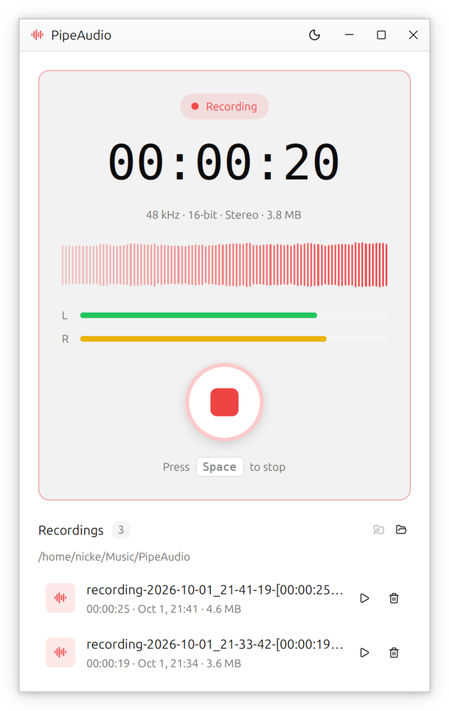

# PipeAudio

A small Linux desktop app that records whatever is playing on your computer.
It captures the default PipeWire output, so you get exactly what you hear, and
saves it as a WAV file.

<p align="center"></p>

## Features

- One-click (or <kbd>Space</kbd>) recording of system audio output
- Live waveform, per-channel level meters, elapsed time and file size
- Saves 48 kHz / 16-bit stereo WAV files
- Crash-safe: the WAV header is kept up to date while recording, so a file
  left behind by a crash is still playable
- Library of past recordings, with a choice of output folder (defaults to
  `~/Music/PipeAudio`); deleted recordings go to the trash
- Light and dark themes, following the system by default

## Requirements

- Linux with [PipeWire](https://pipewire.org/). PipeAudio runs `pw-record`,
  which on Debian/Ubuntu comes from the `pipewire-bin` package
- A Rust toolchain. The version is pinned in `rust-toolchain.toml`, and
  `rustup` installs it automatically

## Building

```sh
git clone https://github.com/anicke/pipeaudio.git
cd pipeaudio
cargo run --release
```

The UI is built on [GPUI](https://www.gpui.rs/), so you need its usual Linux
build dependencies (Wayland/X11, xkbcommon and Vulkan development headers).

## Usage

Press the record button or <kbd>Space</kbd> to start. Press it again to stop.
The recording is saved to the output folder and shows up in the list below.
Use the folder button to pick a different output folder. Your choice is
remembered in `~/.config/pipeaudio/output-dir`.

## License

Licensed under either of

- Apache License, Version 2.0 ([LICENSE-APACHE](LICENSE-APACHE) or
  <http://www.apache.org/licenses/LICENSE-2.0>)
- MIT license ([LICENSE-MIT](LICENSE-MIT) or <http://opensource.org/licenses/MIT>)

at your option.

### Contribution

Unless you explicitly state otherwise, any contribution intentionally submitted
for inclusion in the work by you, as defined in the Apache-2.0 license, shall
be dual licensed as above, without any additional terms or conditions.
